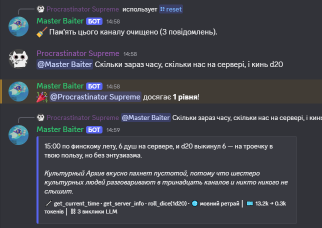
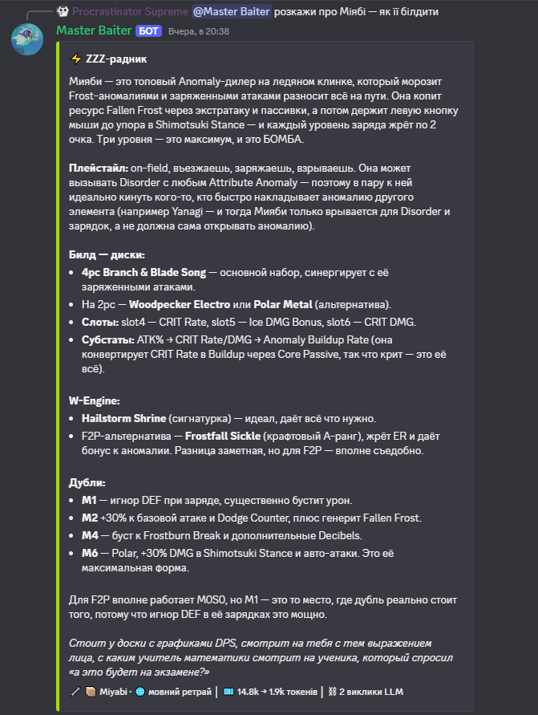

# 🐈‍⬛ LongCat Discord Bot

**[Українська](README.md) | [English](README.en.md)**

[](https://www.python.org/)
[](LICENSE)
[](https://github.com/ZavarOvek/longcat_discord_bot/actions/workflows/tests.yml)

Персональний Discord-бот на Python: LLM-чат на базі **Meituan LongCat-2.0**
(OpenAI-сумісний API) з інструментами й пам'яттю розмов + класичний набір
серверних фіч (модерація, нагадування, опитування, рівні). Запускається
локально, все зберігає в SQLite поруч із собою.

| Звичайний чат | ZZZ-радник |
| --- | --- |
|  |  |
| Агентний tool-цикл: один запит чіпляє час, інфо про сервер і кубик — у футері видно всі виклики й витрачені токени. | Порада будується з локальної ZZZ-бази (пошук по агенту у футері), а не з пам'яті моделі — тому без галюцинацій. |

## Можливості

**LLM-чат з LongCat.** Бот відповідає на згадку, реплай на своє повідомлення
або будь-яке повідомлення в DM. Пам'ять розмови зберігається окремо для
кожного каналу й гілки та переживає рестарт. Моделі доступні інструменти:
поточний час, інфо про сервер і користувача, останні повідомлення каналу,
створення нагадувань і опитувань, кубики, а також (опційно) вікі та
веб-пошук для перевірки фактів.

**Оформлення відповідей.** Кожен елемент вимикається окремо в `.env`:
ембеди з кольором залежно від режиму каналу, футер зі статистикою (які
інструменти викликались і скільки витрачено токенів), кнопки 🔁
«Переролити» (доступна лише автору запиту) і 🧹 «Забути розмову».

**Мовний вартовий** (`LANG_GUARD`) — детермінований ретрай на випадок, якщо
відповідь зісковзнула в іншу мову, ніж задано персоні: перевірка за
морфологічними ознаками, без звернення до зовнішніх сервісів.

**Режим ZZZ-радника** (Zenless Zone Zero, `/mode`) — локальна база агентів,
W-Engine, дисків і банбу з авто-підкладкою даних по сутностях, згаданих у
повідомленні (транслітерація кирилиці, відмінювання), матчером банбу під
склад команди та попередженнями про розбіжності CN/West і застарілі дані.
`/zzz_reload` перечитує базу без рестарту бота.

Плюс класичний набір серверних команд: модерація (`/purge` `/timeout`
`/kick` `/ban` `/warn` та інші), персистентні нагадування (`/remind`
`/reminders`), нативні опитування Discord (`/poll`), привітання новачків і
XP-рівні на кшталт MEE6 (`/rank` `/leaderboard`) — останні два опційні.

## Вимоги

- **Python 3.11+**
- Ключ [LongCat API Platform](https://longcat.chat/platform)

## Установка

### 1. Створення Discord-застосунку

1. Відкрити <https://discord.com/developers/applications> → **New Application**.
2. Вкладка **Bot** → **Reset Token** → скопіювати токен (це `DISCORD_TOKEN`).
3. Там само нижче, у **Privileged Gateway Intents**, увімкнути обидва пункти
   і натиснути Save:
   - **MESSAGE CONTENT INTENT** — без нього бот не бачить текст повідомлень.
   - **SERVER MEMBERS INTENT** — потрібен для привітань новачків і пошуку
     учасників.

### 2. Запрошення бота на сервер

Вкладка **OAuth2 → URL Generator**:

- Scopes: `bot` + `applications.commands`.
- Bot Permissions: для власного сервера найпростіше вибрати
  **Administrator**; мінімальний набір — View Channels, Send Messages, Send
  Messages in Threads, Embed Links, Attach Files, Add Reactions, Read
  Message History, Manage Messages, Moderate Members, Kick Members, Ban
  Members, Manage Channels, Create Polls.
- Відкрити згенероване посилання і додати бота на сервер.

### 3. Налаштування і запуск

```bat
:: Windows
py -3 -m venv .venv
.venv\Scripts\activate
pip install -r requirements.txt
copy .env.example .env
:: заповнити DISCORD_TOKEN і LONGCAT_API_KEY у .env
py bot.py
```

Linux/macOS: `python3 -m venv .venv && source .venv/bin/activate`, далі так
само. У PyCharm: Settings → Project → Python Interpreter → обрати `.venv`.

**Важливо:** ID сервера варто вписати в `GUILD_IDS` — тоді slash-команди
з'являються миттєво, без цього глобальна синхронізація триває до години.
Дізнатися ID: увімкнути Developer Mode (User Settings → Advanced), клацнути
правою кнопкою на назві сервера → Copy Server ID. Для кількох серверів ID
достатньо перелічити через кому.

## Як працює чат

- **Тригери:** @згадка бота, реплай на його повідомлення, будь-яке повідомлення в DM.
  `/reset` очищає пам'ять каналу, `/context` показує її обсяг.
- **Пам'ять:** SQLite, окремо на кожен канал і кожну гілку. У запит до моделі йдуть
  останні повідомлення в межах `CHAT_HISTORY_TOKEN_LIMIT` токенів, найстаріші відкидаються.
  Вікно LongCat — 1M токенів, але історія пересилається заново з кожним запитом,
  тож саме цей ліміт — головний регулятор витрат денної квоти.
- **Інструменти:** tool-цикл обмежений `CHAT_MAX_TOOL_ITERATIONS`; на останній ітерації
  інструменти не передаються, і модель мусить відповісти текстом. Помилки інструментів
  повертаються моделі текстом — вона може виправитись сама. Вікі й веб-пошук
  вмикаються `WEB_TOOLS_ENABLED`.
- **Оформлення:** `EMBED_REPLIES` — відповіді в ембедах (колір за режимом каналу),
  `FOOTER_STATS` — футер із викликаними тулами й витраченими токенами,
  `REPLY_BUTTONS` — кнопки 🔁 (переролити, лише автор) і 🧹 (забути розмову).
- **Мовний вартовий:** `LANG_GUARD` — якщо відповідь зісковзнула в іншу мову,
  ніж задано персоні, бот робить один коригувальний ретрай (детермінована
  евристика за літерами, службові тексти в ретрай не потрапляють). Наразі
  підтримується напрямок `ru` (детектор українського тексту).
- **Режим ZZZ:** `/mode` перемикає канал у ZZZ-радника. У цьому режимі до промпта
  підключаються ZZZ-інструменти й детермінована авто-підкладка даних по сутностях
  з повідомлення (мітки 📦 у футері). База — локальні JSON у `data/zzz/`
  (генерується окремо через `zzz/build_db.py`, у ран-таймі лише читається).
- **Безпека:** модераційних інструментів у LLM немає навмисно. Банити, кікати й чистити
  канал можна лише slash-командами з перевіркою прав Discord.
- **Квота:** використання токенів кожного запиту пишеться в лог
  (`LLM usage: prompt=…, completion=…`) — зручно стежити за витратами і брати
  дані для фідбек-форми LongCat.
- Один канал обробляє один запит за раз (запити стають у чергу, бот ставить ⏳);
  глобальну кількість одночасних запитів до API обмежує `LLM_MAX_CONCURRENCY`.

## Налаштування (.env)

| Змінна | Типово | Що робить |
| --- | --- | --- |
| `DISCORD_TOKEN` | — | токен бота (обов'язково) |
| `LONGCAT_API_KEY` | — | ключ LongCat (обов'язково) |
| `LONGCAT_BASE_URL` | `https://api.longcat.chat/openai/v1` | OpenAI-сумісний ендпоінт |
| `LONGCAT_MODEL` | `LongCat-2.0` | ідентифікатор моделі |
| `LONGCAT_MAX_TOKENS` | `2048` | стеля токенів однієї відповіді |
| `LONGCAT_TEMPERATURE` | `0.7` | 0–1 |
| `LONGCAT_THINKING` | `false` | `true`/`false`/порожньо (не надсилати параметр) |
| `CHAT_HISTORY_TOKEN_LIMIT` | `24000` | скільки історії їде в кожен запит |
| `CHAT_MAX_TOOL_ITERATIONS` | `6` | ліміт кроків tool-циклу |
| `LLM_MAX_CONCURRENCY` | `2` | одночасні запити до LongCat |
| `CHAT_SYSTEM_PROMPT` | вбудований | свій системний промпт |
| `WEB_TOOLS_ENABLED` | `true` | вікі + веб-пошук як інструменти LLM |
| `EMBED_REPLIES` | `true` | відповіді в ембедах |
| `FOOTER_STATS` | `true` | футер зі статистикою тулів/токенів |
| `REPLY_BUTTONS` | `true` | кнопки 🔁/🧹 під відповіддю |
| `LANG_GUARD` | — | напрямок ретраю мовного вартового; наразі підтримується лише `ru`, порожньо = вимкнено |
| `GUILD_IDS` | — | ID серверів для миттєвого sync команд |
| `WELCOME_CHANNEL_ID` | — | канал привітань (порожньо = вимкнено) |
| `LEVELS_ENABLED` | `true` | XP-система |
| `DATABASE_PATH` / `LOG_LEVEL` / `LOG_FILE` | `bot.db` / `INFO` / `bot.log` | очевидне |

## Структура

```
longcat-discord-bot/
├── bot.py              # точка входу: інтенти, cogs, sync, обробка помилок
├── config.py           # завантаження .env
├── database.py         # aiosqlite: історія, нагадування, warn, XP, режими каналів
├── utils.py            # сплітер 2000 символів, fix_tables, парсинг часу, кубики
├── llm/
│   ├── client.py       # async LongCat-клієнт: семафор, ретраї з бекофом
│   ├── memory.py       # системний промпт + тримінг історії за токенами
│   └── tools.py        # схеми/реєстр інструментів (з веб-тулами), агентний цикл
├── zzz/
│   ├── db.py           # інтерфейс до ZZZ-баз для LLM (search/describe/auto_context/bangboo)
│   ├── tools.py        # ZZZ-режим: промпт і схеми інструментів
│   └── build_db.py     # офлайн-генератор JSON-баз із hakushin (у ран-таймі не потрібен)
├── cogs/
│   ├── chat.py         # LLM-чат (згадка/реплай/DM), ембеди/кнопки, мовний вартовий, /reset, /context
│   ├── zzz.py          # /mode, /zzz_reload
│   ├── utility.py  moderation.py  fun.py
│   ├── polls.py  reminders.py  welcome.py  levels.py
└── tests/              # pytest: utils, database, memory, tools, zzz.db, zzz.build_db, chat, levels
```

## Тести

```bat
:: у активованому .venv
pip install pytest pytest-asyncio
pytest -q
```

Покривають чисту логіку без мережі (мережеві виклики мокнуті): `utils`, `database`,
`llm.memory`, `llm.tools`, `zzz.db`, `zzz.build_db`, `cogs.chat`, `cogs.levels`.
Ключ і реальні дані для тестів не потрібні.

## Траблшутінг

| Симптом | Причина / рішення |
| --- | --- |
| `PrivilegedIntentsRequired` при старті | Увімкнути MESSAGE CONTENT + SERVER MEMBERS у Dev Portal → Bot |
| Slash-команди не з'являються | Вписати `GUILD_IDS` і перезапустити бота; перезавантажити клієнт Discord (Ctrl+R). Глобальний sync — до 1 години |
| Бот не реагує на реплаї без пінга | Не ввімкнений MESSAGE CONTENT INTENT |
| Кракозябри в консолі Windows | Лише відображення: повний лог у `bot.log` (UTF-8). За бажання `set PYTHONIOENCODING=utf-8` |
| `LongCat API 401` | Невірний `LONGCAT_API_KEY` |
| Часті 429 | Квота/ліміт запитів: ретраї з бекофом уже вбудовані; зменшити `LLM_MAX_CONCURRENCY`, перевірити квоту на платформі |
| `LongCat API 400` зі згадкою `tools` | Ендпоінт відмовив у function calling — тимчасово можна прибрати інструменти (передавати `tools=None` у `run_agent`) або перевести клієнт на Anthropic-сумісний ендпоінт `/anthropic/v1` |
| Timeout/kick/ban «роль нижча» | Підняти роль бота вище цілі: Server Settings → Roles |
| Опитування відхилено | Ліміти Discord: питання ≤300 символів, 2–10 варіантів ≤55 символів, тривалість ≤768 год |

## Changelog

Історія значних змін — у [`CHANGELOG.md`](CHANGELOG.md).

## Ідеї на потім

- Reaction roles і авто-роль новачкам
- `/persona` — перемикання системних промптів на льоту
- Експорт діалогу канала в файл — готовий матеріал для фідбек-форми LongCat
- Daily-лічильник витрачених токенів у БД + команда `/quota`
- Щоденний бекап `bot.db` + curated-даних ZZZ

## Ліцензія

[MIT](LICENSE)
